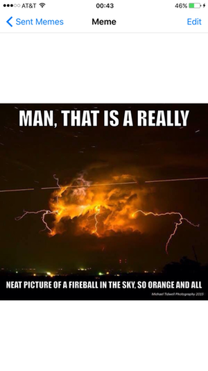
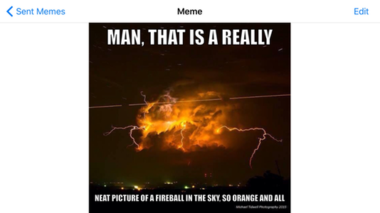
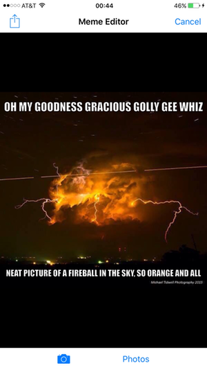
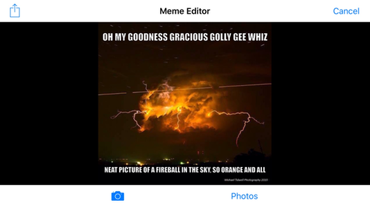
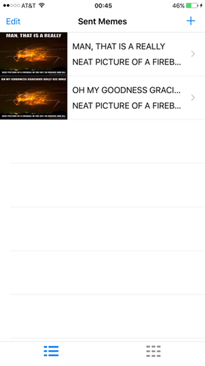
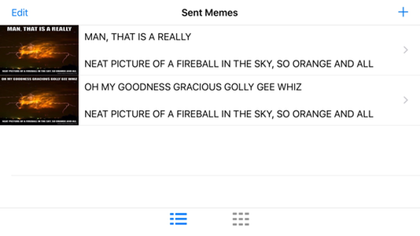
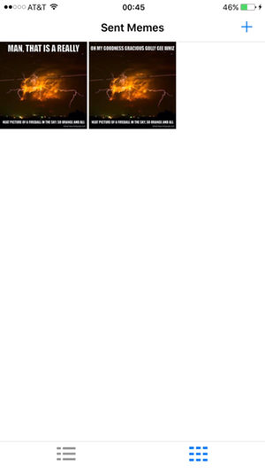
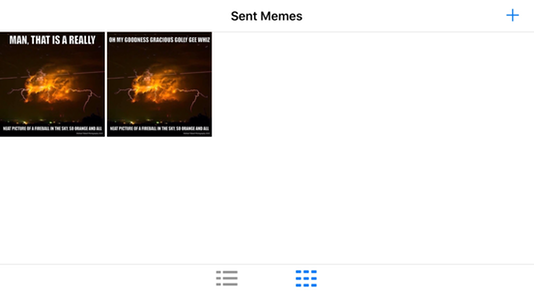

# Meme Detail View

Please read [Meme Editor View](./MemeEditorView.md) before reading this page.

##### Sent Meme Detail
| | |
| :---: | :---: |
|  |  | 

* Tap the **< Sent Memes** button to return to the **Sent Memes Tabbed View**.
* Tap the **Edit** button to modify this meme in the **Meme Editor View**. 

##### Meme Editor w/ Edited Meme
| | |
| :---: | :---: |
|  |  | 

* Use the **Meme Editor View** to edit and distribute this new meme.
* A new meme is saved in the memory store;  the original meme is not overwritten.
* As before, control will return to the **Meme Editor View** when the activity is complete.
  - However, in this instance, tapping the **Cancel** button will cause a return to the **Meme Detail View**.

##### Meme w/ Edits is Saved
| | |
| :---: | :---: |
|       |  | 
| | |
|  |  | 

