# Meme Editor View

##### Buttons
| Share | Camera |
| :---: | :---: |
|  |  | 

##### Editor is Empty
| | |
| :---: | :---: |
| 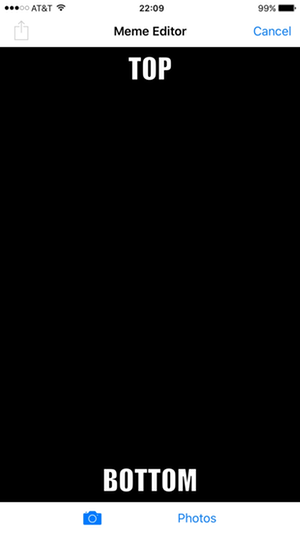 | 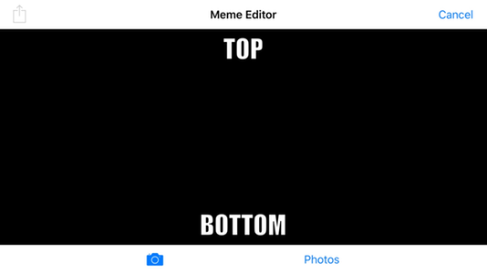 | 

* At any time, tap the **Cancel** button to return to the Sent Memes Tabbed View.
* **TOP** & **BOTTOM** fields cannot be edited until an image has been chosen for the meme.
* The **Share** button is unavailable until an image has been chosen for the meme.
* Tap the **Camera** button to activate the device camera and acquire image.
* Tap the **Photos** button to present the Photo Libary and select the desired image.

##### Editor has Selected Image
| | |
| :---: | :---: |
| 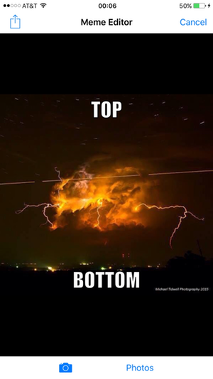 | 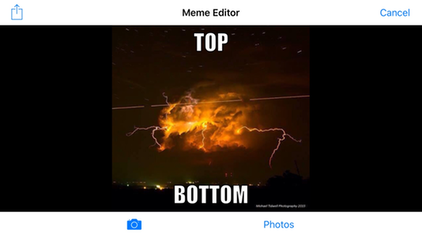 | 

* The **Share** button is now available.
* The image has been scaled to fit the editor view.
* **TOP** & **BOTTOM** fields are now editable, and have been realigned to be positioned inside the image.  
* Tap a field to begin editing in that field.

##### Editing Top Field
| | |
| :---: | :---: |
| 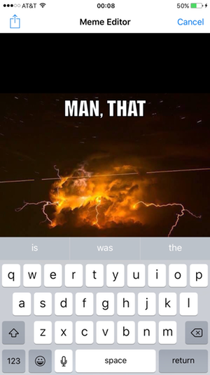 | 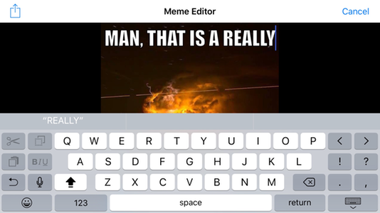 | 

##### Editing Bottom Field
| | |
| :---: | :---: |
| 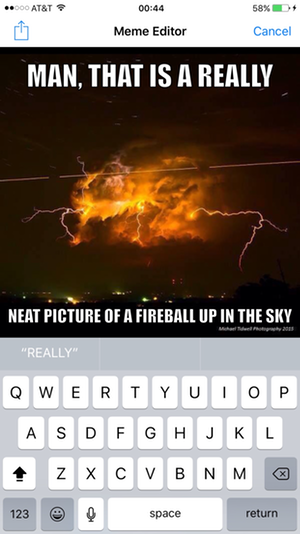 | 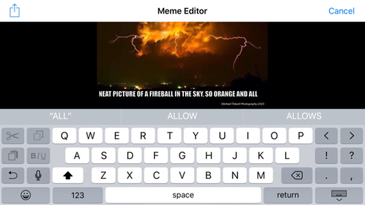 | 

* When editing the **TOP** text field, the **BOTTOM** text field is obscured by the keyboard.
* When editing the **BOTTOM** text field, the editor view slides up so that the field is not obscured.
* Font size shrinks (up to a point) to accomodate longer text entries.

##### Completed Meme
| | |
| :---: | :---: |
| 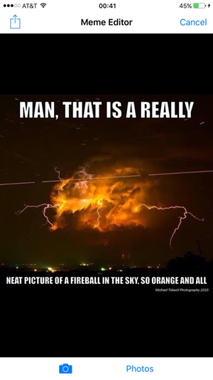 | 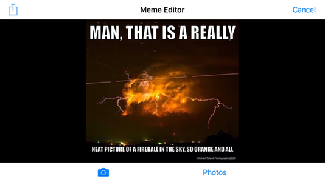 | 

* Tap the **Share** button to present distribution options (such an email and text).

##### Activity View
| | |
| :---: | :---: |
| 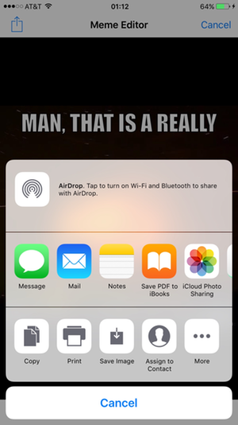 | 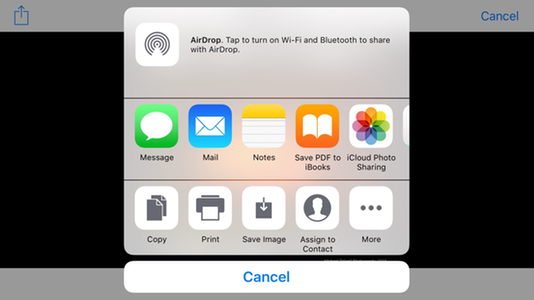 | 

* At this point, the meme has been placed in the local memory store, even if the **Cancel** button is tapped.
* Control returns to the Meme Editor View after the activity is completed.  At this point:
  - Tap the **Cancel** button to return to the Sent Memes Tabbed View;  or,
  - Continue to use the Meme Editor as before.

##### Saved Meme
| | |
| :---: | :---: |
| 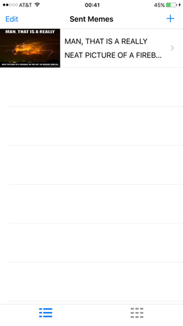      | 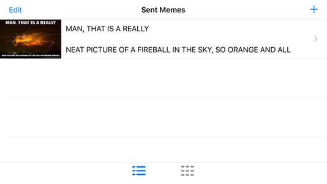 | 
| | |
| 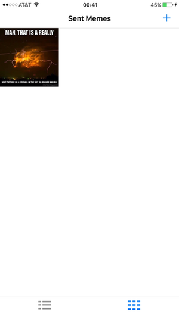 | 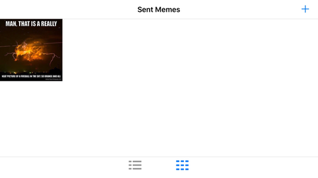 | 
