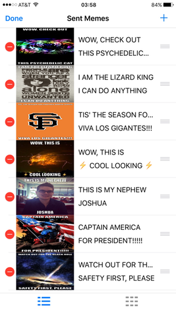
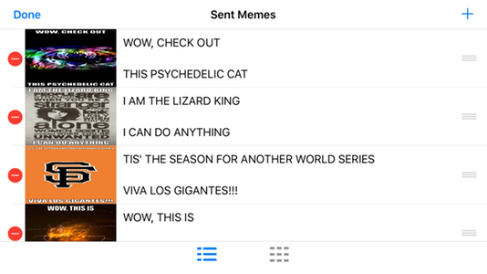
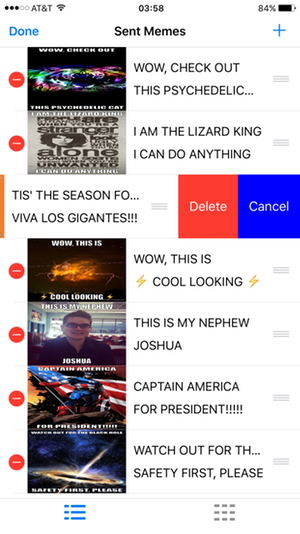
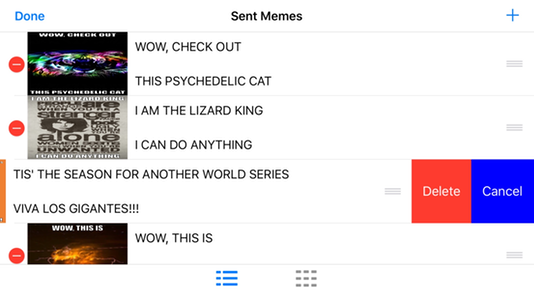
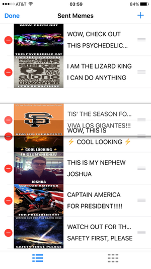
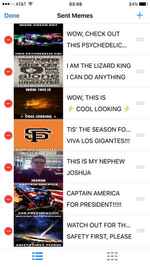

# Sent Memes Tabbed View

* The **Edit** button was tapped to enable table edit mode.

| | |
| :---: | :---: |
|  |  | 

* Tap the **Select Control** (red dot w/ white dash) at the left end of a row to present **Delete** and **Cancel** options for that row.
* Tap the **Cancel** button or the **Done** button in order to cancel the operation;  this terminates table edit mode.
* Tap the **Delete** button to remove the row from the table, causing the associated meme to be deleted from the memory store;  this terminates table edit mode.

| | |
| :---: | :---: |
|  |  | 

* Tap and hold the **Reorder Control** (3 stacked grey lines) at the right end of a row to enable drag, then drag the row to a new position in the table.

| | |
| :---: | :---: |
|  |  | 
